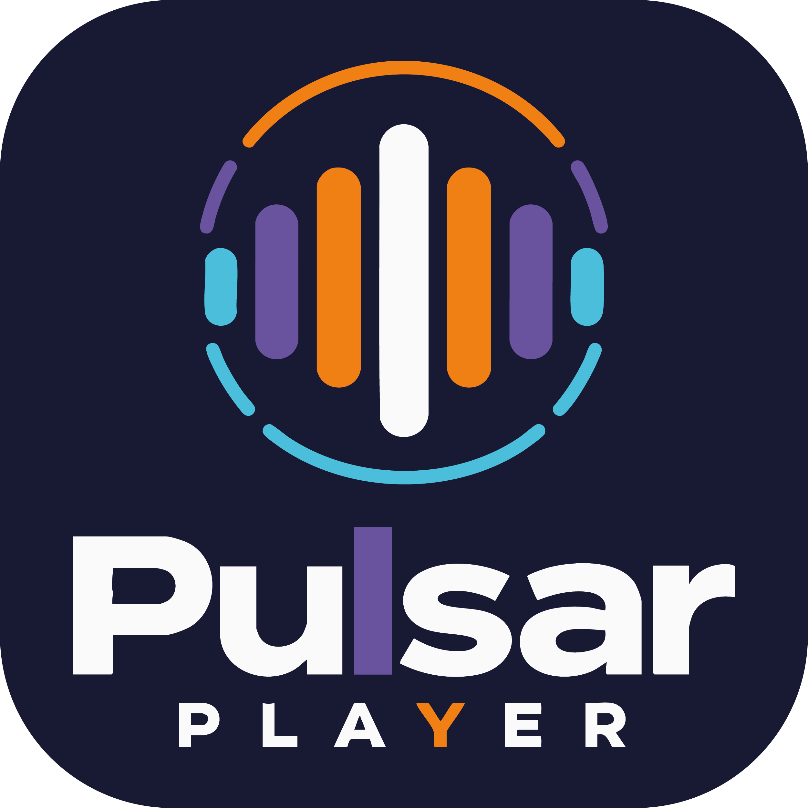

  

  # Pulsar
  ### *A Nova Dimensão do Streaming de Música no Seu Desktop.*

  

    <strong>Ultra-leve. Sem anúncios. Estética Apple Liquid Glass forjada em Rust e Svelte 5.</strong>
  

  

    
    
    
    
    
    
    
  

  

    <a href="#-por-que-o-pulsar">Por que o Pulsar?</a> •
    <a href="#-superpoderes-do-aplicativo">Recursos & Funções</a> •
    <a href="#-onde-baixar">Onde Baixar</a> •
    <a href="#-patch-notes-o-que-há-de-novo">Patch Notes</a> •
    <a href="#-roadmap-de-funcionalidades">Roadmap</a> •
    <a href="#-tecnologia-de-ponta">Tecnologia</a>
  

---

## ⚡ Por que o Pulsar?

Se você ama música no computador, provavelmente já passou por isso:

* 😤 **Cansado de assinaturas mensais caras** apenas para ter o direito básico de não ouvir propagandas estridentes a cada duas faixas.
* 🐌 **Cansado de players inchados em Electron/Chromium** que sequestram mais de **1.5 GB da sua memória RAM** só para tocar um áudio em segundo plano enquanto você tenta jogar ou trabalhar.
* 🧊 **Cansado de interfaces genéricas, chatas e opacas** que parecem saídas de uma planilha do Excel de 2012.

> [!TIP]
> **O Pulsar resolve isso de uma vez por todas.**
> Forjado sobre a arquitetura ultrarrápida do **Rust (Tauri v2)** e a reatividade cirúrgica do **Svelte 5**, o Pulsar consome uma fração irrisória dos recursos do seu PC (~30MB em background), inicia instantaneamente e entrega uma experiência visual inspirada na mais alta engenharia de design de materiais da Apple (**visionOS & iOS Liquid Glass**).

---

## ✨ Superpoderes do Aplicativo

### 🟢 Importação Universal: Spotify, YouTube & YouTube Music
Migre sua biblioteca em segundos sem perder nenhuma das suas faixas favoritas:
* **Suporte Completo a Links:** Cole links diretos de faixas avulsas, álbuns e **playlists inteiras** do Spotify (`open.spotify.com`), YouTube padrão e YouTube Music (`music.youtube.com`).
* **Casamento Acústico Inteligente por Duração:** O motor em Rust se conecta à API oficial do Spotify para extrair os metadados ricos (capas em HD, multi-artistas, ISRC e duração exata em milissegundos). Em seguida, busca o áudio correspondente no YouTube via `yt-dlp` e calcula um índice de confiança acústica (`HIGH`, `MEDIUM`, `LOW`), garantindo a reprodução exata da versão correta da faixa sem anúncios.
* **Botões Rápidos Temáticos:** Identificação visual imediata tanto na barra lateral quanto no topo da tela inicial:
  * 🔴 **Botão Coral (`#FC7753`):** Importação rápida do YouTube & YouTube Music.
  * 🟢 **Botão Verde Oficial (`#1DB954`):** Importação rápida do Spotify.
* **Inline Setup Card de Credenciais:** Se você colar um link do Spotify sem credenciais cadastradas, o modal exibe um assistente amigável com link direto para o dashboard de desenvolvedores do Spotify, salvamento no banco local SQLite e retentativa automática com um clique.

---

### 📡 Pulsar Connect: Transmissão Sem Fio Multi-Dispositivo & Universal
Leve sua música para qualquer cômodo da sua casa ou escritório com uma central de transmissão unificada inspirada no ecossistema Apple AirPlay:
* 📺 **Smart TVs & Receptores DLNA/UPnP Universais (LG WebOS, Samsung Tizen, Sony Bravia, Roku, Fire TV):**
  * Transmissão direta sem cabos através da rede Wi-Fi local escaneando múltiplos alvos SSDP (`MediaRenderer:1/2`, `AVTransport:1`, `RenderingControl:1`, `upnp:rootdevice`, `dial:1`, `ssdp:all`).
  * **Controle de Volume com Debounce Inteligente (220ms):** Arraste o slider de volume livremente a 60fps sem sobrecarregar o microservidor HTTP da TV; a comunicação SOAP é consolidada e imune a travamentos.
  * **Auto-Recovery do Proxy de Streaming:** Se a CDN do YouTube retornar HTTP 403 Forbidden ao abrir o clipe de vídeo, o backend em Rust re-resolve instantaneamente um link direto novo sem que a TV interrompa a música.
  * **Transição Suave de Fila & Retry Anti-Erro 701:** A troca de músicas é serializada assincronamente com retentativa preventiva caso o receptor da TV ainda esteja em estado de transição.
  * **Relógio Mestre Defensivo (Local Master Clock):** Mesmo que a Smart TV demore para retornar a telemetria ou tenha oscilações de rede, a timeline do Pulsar continua fluida e o app avança para a próxima faixa com precisão.
* 📻 **Google Home & Nest Mini (Protocolo Google Cast Nativo):**
  * Descoberta automática de caixas inteligentes na LAN via socket mDNS (`UDP 224.0.0.251:5353`) escaneando serviços `_googlecast._tcp.local`.
  * Streaming direto de altíssima fidelidade com handshake seguro TLS na porta 8009, integração com a API Eureka (porta 8008) e Default Media Receiver.
* 🔊 **Descoberta Universal Bluetooth & Speakers (Drivers Nativos Windows):**
  * Detecção baseada diretamente em hardware via propriedades do barramento PnP (`PKEY_Device_EnumeratorName`: `BTHENUM` e `BTHHFENUM`) e varredura do Registro do Windows (`BTHPORT`).
  * Compatibilidade universal com fones e caixas de som de qualquer fabricante: **Haylou, Hi-Lo, Pro, JBL, Edifier, Sony, fones TWS genéricos** e periféricos de áudio sem fio.
  * Silêncio absoluto de sistema: o painel nativo do Windows abre sem nenhuma janela de prompt/conhost piscando (`CREATE_NO_WINDOW = 0x08000000`).
* 🩺 **Console de Diagnóstico & Logs Integrado:**
  * Ícone dedicado de Terminal no cabeçalho do Pulsar Connect para inspecionar em tempo real o histórico persistente de conexão (`pulsar.log`), filtrar por severidade e copiar diagnósticos com um clique.
* 🪟 **Modal Apple Liquid Glass em 4 Categorias:**
  1. 💻 **Este Computador** (Alto-falantes padrão do Windows)
  2. 🔊 **Fones & Speakers Bluetooth** (Detecção universal por hardware)
  3. 📻 **Google Home & Nest** (Caixas inteligentes Google Cast)
  4. 📺 **Smart TVs & Receptores DLNA** (Televisores e receivers de sala)

---

### 🔄 Sistema de Atualização Automática Elegante (OTA Apple-Like)
Mantenha seu Pulsar sempre na última versão sem dor de cabeça:
* **Detecção Silenciosa e Segura:** O app verifica releases através de um manifesto descentralizado `latest.json`, aceitando links diretos de qualquer servidor de distribuição rápida.
* **Modal de Atualização Seamless:** Interface translúcida com animações fluidas, exibindo as novidades da versão formatadas, cálculo dinâmico de progresso e barra de download elegante.
* **Instalação com Um Clique:** Conclua o download do executável oficial e atualize seu software sem precisar abrir páginas da web ou substituir arquivos manualmente.

---

### 🪟 Mini Player Flutuante Apple Liquid Glass (visionOS Experience)
Precisa de foco total no seu trabalho ou jogo sem abrir mão da sua trilha sonora?
* **Translucidez Dinâmica Multicamada:** Superfície de vidro escuro com desfoque profundo (`backdrop-blur-3xl`) que absorve as cores do seu wallpaper e da capa da música.
* **Luz Especular Superior:** Reflexo de luz físico na borda chanfrada superior, reproduzindo a sensação tátil de uma lente de vidro real.
* **Ambient Capa Glow:** A arte do álbum projeta uma aura luminosa e difusa por trás do vidro em tempo real.
* **Grip Tátil iOS & Movimentação 100% Livre:** Arraste o mini player para qualquer canto da sua área de trabalho com fluidez nativa e sem travamentos no DWM do Windows.
* **Alternância Áudio/Vídeo Compacta:** Alterne entre a capa da faixa e o clipe oficial em miniatura com um único clique.

---

### 🎛️ Controles Nativos na Barra de Tarefas do Windows
Você não precisa parar o que está fazendo nem minimizar sua tela cheia para trocar de música:
* Ao passar o mouse sobre o ícone do Pulsar na barra de tarefas do Windows, surge uma **miniatura interativa** (estilo Spotify).
* Controle instantâneo com botões nativos: **[Favoritar]**, **[Faixa Anterior]**, **[Play/Pause]** e **[Próxima Faixa]**, desenhados com ícones nítidos em alta definição via API Win32 `ITaskbarList3`.

---

### 🎵 Last.fm Scrobbler Integrado e Inteligente
* Conecte sua conta do **Last.fm** nativamente em segundos com fluxo OAuth no navegador padrão via `@tauri-apps/plugin-opener`.
* O motor do Pulsar rastreia sua reprodução em tempo real com **Now Playing dinâmico** e efetua o **Scrobble automático** ao atingir 50% ou 4 minutos da faixa.
* Algoritmo inteligente de extração com fallback em cascata que identifica artistas e títulos mesmo em faixas raras sem metadados convencionais.

---

### 📺 Modo Duplo Sincronizado: Som Cristalino ou Clipe Oficial
* Escolha como você quer curtir:
  * **Modo Áudio:** Som de alta fidelidade via proxy local Axum (41235) com suporte a HTTP 206 Range (seeking instantâneo) e sem desperdício de dados.
  * **Modo Vídeo 16:9:** O clipe oficial roda sincronizado em alta definição sem travamentos, telas pretas ou recarregamentos súbitos ao pausar e avançar.

---

### 👥 Pulsar Social & Presença em Tempo Real
A música fica muito melhor compartilhada:
* **Perfis com TAG Única:** Crie seu perfil e receba uma tag alfanumérica exclusiva (ex: `@seu_nome#7X9A`).
* **Status "Ouvindo Agora":** Seus amigos sabem exatamente o que está tocando no seu player em tempo real.
* **Direct Chat Estilo iMessage:** Converse instantaneamente e compartilhe músicas que seus amigos podem dar Play direto da conversa.
* **Modo Convidado Offline:** Quer usar o app apenas localmente sem criar conta? Com um clique você entra no modo offline e sua biblioteca fica 100% no seu disco.

---

### 📱 Blindagem Total para Monitores Pivotados e Telas Verticais
* Usa um segundo monitor na vertical (9:16) para programar, codar ou ler chats?
* O Pulsar conta com uma malha de layout responsiva onde **nenhum modal vaza**, nenhum botão de confirmação fica escondido e as capas se ajustam harmonicamente à altura da sua janela.

---

## 🚀 Onde Baixar?

Você não precisa compilar nem lidar com código para aproveitar o Pulsar.

> [!IMPORTANT]
> **Toda nova versão oficial do instalador (.exe) é publicada diretamente na aba de [Releases do GitHub](https://github.com/pauloviccs/Pulsar/releases).**
>
> Basta acessar a página de lançamentos, baixar o executável [`Pulsar_0.2.6_x64-setup.exe`](https://github.com/pauloviccs/Pulsar/releases/download/v0.2.6/Pulsar_0.2.6_x64-setup.exe), instalar no seu Windows em menos de 10 segundos e começar a ouvir!

---

## 📝 Patch Notes: O Que Há de Novo

### 🌟 Versão Atual: `v0.2.6` *(Central Home Dashboard & Sidebar Retrátil Liquid Glass)*

* 🏠 **Nova Central Home Dashboard (Página Inicial):**
  * **Hero Banner Monumental:** Capa em alta definição com iluminação difusa reativa, badge dinâmica (*PLAYLIST EM ALTA / DESTAQUE*) e botão primário de ação rápida **"Ouvir Agora"** com 1 clique + suporte ao modo aleatório (*Shuffle*).
  * **Pílulas de Filtro Instantâneas:** Sub-header ágil com `Tudo`, `Música` e `Comunidade`, adaptando o feed sem recarregar a tela.
  * **Grid Rápido 2x4 (Quick Access):** 8 cartões retangulares no topo (com o cartão exclusivo *"Músicas Curtidas"* em gradiente violeta/ciano e suas playlists mais ouvidas) com botão de Play circular verde-esmeralda/ciano flutuante no hover.
  * **Trilhos Horizontais de Descoberta:** Seções em carrossel para *"Mais Ouvidas por Você"* e *"Em Alta na Comunidade"* (com dados de criadores e plays do Supabase).
* 🗂️ **Sidebar Retrátil Liquid Glass (Fim da Rigidez da Barra Lateral):**
  * **Botão `[|]` de Alternância:** Alterne com 1 clique entre o **Modo Expandido (260px)** e o **Modo Compacto (72px)**.
  * **Modo Compacto:** Transforma a barra lateral em uma elegante coluna vertical com as **mini-capas quadradas** das suas playlists com tooltips flutuantes (inspirado no Spotify), liberando quase 200 pixels para o dashboard respirar em qualquer monitor.
  * **Novo Atalho "Início":** Navegue instantaneamente para a Central Home a partir de qualquer visualização.
* ☁️ **Sincronização em Nuvem Supabase Completa (Multi-Dispositivo):**
  * Sincronização em tempo real de playlists, faixas salvas na biblioteca, favoritos, histórico recente e configurações de áudio/player via `syncEngine.ts`.
  * Novas métricas públicas de `play_count` e `likes_count` com a RPC `get_community_trending_playlists`.
* 🔄 **Correção da Checagem de Versão Dinâmica:**
  * O motor Rust agora consulta a versão real do executável em runtime via comando `get_app_version`, eliminando o bug que travava o aplicativo em `v0.2.2` e disparava toasts indevidos.
* 📦 **Novos Pacotes Oficiais de Instalação Release v0.2.6:**
  * Instalador NSIS ultra-leve: [`Pulsar_0.2.6_x64-setup.exe`](https://github.com/pauloviccs/Pulsar/releases/download/v0.2.6/Pulsar_0.2.6_x64-setup.exe) (~21.4 MB).
  * Pacote corporativo Windows Installer: `Pulsar_0.2.6_x64_en-US.msi` (~22.9 MB).

---

### `v0.2.5` *(Estabilidade Total de Smart TVs & Descoberta Universal)*

* 📺 **Blindagem & Estabilização de Conexões com Smart TVs (LG WebOS, Samsung, Sony Bravia):**
  * **Debounce de Volume (220ms):** Arrastar o controle deslizante de volume na barra do player agora amortece requisições em trânsito, acabando com a sobrecarga de chamadas SOAP que derrubava receptores de Smart TVs.
  * **Fim do Spam de Volume no Player:** Removido o envio contínuo a cada segundo de telemetria de volume, deixando o canal de streaming leve e desimpedido.
  * **Auto-Recovery Inteligente do Proxy Local:** Ao alternar para o modo vídeo, o proxy local em Rust detecta e recupera instantaneamente qualquer erro HTTP 403 Forbidden da CDN do YouTube, re-resolvendo o link direto em background sem que a Smart TV pare de tocar.
  * **Transição Serializada de Fila & Retry Anti-Erro 701:** A troca rápida de músicas agora aguarda a conclusão da faixa anterior e aplica retentativa automática com backoff e stop preventivo caso a TV acuse transição de estado pendente.
  * **Isolamento de Falhas no AudioRouter:** Alertas transitórios de transporte não acionam mais o fallback abrupto para o computador; a música continua tocando firme na TV.
* 📡 **Descoberta Universal de Redes Wi-Fi & Receptores DLNA:**
  * Varredura SSDP ampliada com broadcast multi-alvo cobrindo `MediaRenderer:1/2`, `AVTransport:1`, `RenderingControl:1`, `rootdevice`, `dial:1` e `ssdp:all`, integrando Smart TVs Samsung Tizen, Sony, LG, Roku, Fire TV e caixas de som Wi-Fi.
* 🎧 **Detecção Universal de Bluetooth via Drivers Win32:**
  * Reconhecimento aprofundado por hardware via barramento PnP (`PKEY_Device_EnumeratorName`: `BTHENUM` e `BTHHFENUM`) e chaves do Registro do Windows (`BTHPORT`).
  * Suporte total a fones e caixas de som de todas as marcas: **Haylou, Hi-Lo, Pro, JBL, Edifier, Sony, fones TWS genéricos** e periféricos Bluetooth.
* 📦 **Novos Pacotes Oficiais de Instalação Release v0.2.5:**
  * Instalador NSIS ultra-leve: [`Pulsar_0.2.5_x64-setup.exe`](https://github.com/pauloviccs/Pulsar/releases/download/v0.2.5/Pulsar_0.2.5_x64-setup.exe) (~21.3 MB).
  * Pacote corporativo Windows Installer: `Pulsar_0.2.5_x64_en-US.msi` (~22.8 MB).

---

### `v0.2.4` *(Silenciamento de Janelas de Terminal & Console de Logs)*

* 🩺 **Console de Logs & Diagnóstico Integrado:** Módulo Rust dedicado (`logger.rs`) com persistência em disco (`%APPDATA%/com.pulsar.app/logs/pulsar.log`), buffer circular e modal visual (`LogsModal.svelte`) com busca em tempo real, filtros de severidade e atalho para abrir o arquivo no Explorer.
* 🪟 **Eliminação Completa de Janelas Pretas:** Chamadas de sistema para o painel de pareamento do Windows foram blindadas com a flag Win32 `CREATE_NO_WINDOW = 0x08000000`.
* 🔊 **Filtro WASAPI de Alta Fidelidade:** Exibição exclusiva de dispositivos em estado ativo (`DEVICE_STATE_ACTIVE`) e higienização de nomes duplicados Hands-Free/Stereo.

---

### `v0.2.3` *(Correções de Transporte & Reconexão)*

* ⏯️ **Ajustes de Transporte UPnP:** Refinamento no comando play/pause com mecanismo de fallback seek-based e sincronização dos botões da miniatura da barra de tarefas.

---

### `v0.2.2` *(Pulsar Connect: LG TV, Google Home & JBL Bluetooth)*

* 📡 **Controle Total de Smart TVs (LG WebOS & Samsung Tizen):**
  * **Relógio Mestre Defensivo (Local Master Clock):** Timeline resiliente que avança perfeitamente mesmo com latência da TV.
  * **Avanço Automático de Músicas na TV:** O app detecta o fim exato da música e despacha a próxima da fila automaticamente.
  * **Transições Limpas Anti-Erro 701:** Parada preventiva assíncrona (`stop` com 120ms de estabilização) antes de `SetAVTransportURI`.
  * **Smart Pause com Retomada por Seek:** Fallback automático caso a TV rejeite pausa em fluxos HTTP contínuos.
* 📻 **Integração Google Home & Nest (Google Cast Nativo):**
  * Descoberta rápida via socket mDNS (`UDP 224.0.0.251:5353`) escaneando `_googlecast._tcp.local`.
  * Streaming direto com handshake seguro TLS na porta 8009, Default Media Receiver e controle de volume.
* 🔊 **Speakers JBL, Fones & Bluetooth (Windows CoreAudio API):**
  * Enumeração COM em Rust (`IMMDeviceEnumerator`), permitindo identificar caixas de som da JBL (Flip, Charge, Boombox, Go) e fones Bluetooth pareados com nomes reais.
* 🪟 **Modal Apple Liquid Glass em 4 Categorias:**
  * Categorização inteligente: Computador, Speakers JBL/Bluetooth, Google Home/Nest e Smart TVs DLNA.
* 📦 **Novo Instalador Windows Release v0.2.2:**
  * Executável NSIS otimizado de alta performance: `Pulsar_0.2.2_x64-setup.exe` (21.3 MB).

---

### `v0.2.1` *(Estabilização de Áudio & Adapters)*

* 🛠️ **Refatoração do AudioRouter:**
  * Estruturação da arquitetura de múltiplos targets de áudio com interface `AudioOutputTarget`.
  * Suporte a scanner extensível e transições suaves entre saídas locais e remotas.

---

### `v0.2.0` *(Sistema de Auto-Update Integrado & OTA)*

* 🔄 **Atualizador Automático Elegante:**
  * Notificações seamless de novas versões disponíveis através de `latest.json`.
  * Modal visual no padrão Apple com visualização de patch notes, velocidade de transferência e barra de progresso.
  * Suporte a links diretos de qualquer servidor de distribuição rápida sem restrição ao GitHub.

---

### `v0.1.2` *(Multi-Platform Import & Acoustic Matching)*

* 🟢 **Importação Universal Spotify & YouTube Music:**
  * Suporte a links de faixas, playlists e álbuns do Spotify (`open.spotify.com`) e YouTube Music (`music.youtube.com`).
  * Motor Rust com integração oficial à Spotify Web API (Client Credentials Flow com cache inteligente de token).
  * Algoritmo de correspondência acústica por duração (casamento de metadados do Spotify com extração de áudio via `yt-dlp`).
* 🎨 **Botões Rápidos com Cores Temáticas Dedicadas:**
  * Botão **Coral** para YouTube e botão **Verde Oficial** para Spotify na Sidebar e no Header superior, proporcionando acesso rápido contextual.
* ⚙️ **Gerenciador de Credenciais Spotify Web API:**
  * Configuração nas preferências (`Configurações > Integrações`) e *Inline Setup Card* no próprio modal de importação com retentativa automática.
* 📋 **Ergonomia & Correção de Input:**
  * Botão de colar desacoplado em cápsula flex lateral externa, eliminando cortes de texto em URLs longas.

---

### `v0.1.1` *(Liquid Glass & Taskbar Revolution)*

* 🪟 **Novo Mini Player Apple Liquid Glass:** Redesign total visionOS, destravamento no DWM e ambient glow adaptativo.
* 🎛️ **Controles na Barra de Tarefas do Windows (Taskbar Preview):** Miniatura com 4 botões nativos via Win32 `ITaskbarList3`.
* 🎵 **Correção Definitiva do Last.fm:** Sincronização em tempo real das stores com o motor de áudio e fallback inteligente de artista.
* 📐 **Blindagem Contra Quebras Verticais:** Modais com teto de altura rígido (`max-h-[88vh]`) e cabeçalho elástico.

---

## 🗺️ Roadmap de Funcionalidades

| Recurso / Funcionalidade | Status | Categoria |
|---|:---:|---|
| **Streaming & Busca Instantânea sem Anúncios** | ✅ Pronto | Áudio & Core |
| **Importação Rápida Spotify, YouTube & YT Music** | ✅ Pronto | Biblioteca & Importação |
| **Casamento Acústico por Duração & Metadados** | ✅ Pronto | Engine de Áudio |
| **Mini Player Flutuante Apple Liquid Glass** | ✅ Pronto | Interface & Desktop |
| **Controles na Barra de Tarefas do Windows (Taskbar)** | ✅ Pronto | Integração Windows |
| **Scrobble Automático no Last.fm & Now Playing** | ✅ Pronto | Serviços Conectados |
| **Perfis Sociais com Tags (#) e Status em Tempo Real** | ✅ Pronto | Social & Presença |
| **Estúdio de Recorte 1:1 de Capas de Playlist** | ✅ Pronto | Personalização |
| **Suporte Nativo a Monitores Verticais / Telas Retrato** | ✅ Pronto | UI / Responsividade |
| **Pulsar Connect: Smart TVs & DLNA (Volume Debounced & Auto-Recovery)** | ✅ Pronto | Conectividade & Áudio |
| **Pulsar Connect: Google Home & Nest (Google Cast V2)** | ✅ Pronto | Conectividade & Áudio |
| **Pulsar Connect: Descoberta Universal Bluetooth & Wi-Fi (Win32 PnP)** | ✅ Pronto | Conectividade & Áudio |
| **Console de Diagnóstico & Logs Integrado (Disco & UI)** | ✅ Pronto | Sistema & Diagnóstico |
| **Sistema de Atualizações Automáticas (OTA Apple-Like)** | ✅ Pronto | Sistema & Lifecycle |
| **Equalizador Paramétrico de 10 Bandas com Presets** | ⏳ Em Breve | Qualidade de Som |
| **Letras Sincronizadas em Tempo Real (Estilo Karaokê)** | ⏳ Em Breve | Experiência Visual |
| **Cache Inteligente para Modo 100% Offline** | ⏳ Planejado | Performance |
| **Discord Rich Presence Dinâmico e Detalhado** | ⏳ Planejado | Integrações |
| **Seletor de Temas Personalizados Liquid Glass (OLED, Frost, Neon)** | ⏳ Planejado | Customização |

---

## 🛠️ Tecnologia de Ponta

O Pulsar foi projetado para quem valoriza arquitetura limpa e performance pura:

* **Engine Desktop:** [Tauri v2](https://tauri.app/) (Rust 2021) — binário compilado nativo, seguro e incrivelmente leve.
* **Pulsar Connect:** Protocolo Google Cast V2 com TLS via mDNS (`224.0.0.251:5353`), SOAP UPnP/DLNA AVTransport v1.0 com retentativa defensiva, proxy local Axum com Auto-Recovery anti-403 e drivers Win32 PnP (`BTHENUM`/`BTHHFENUM`) combinados à Windows CoreAudio API (`IMMDeviceEnumerator`).
* **Camada de Interface:** [Svelte 5](https://svelte.dev/) com Runas reativas (`$state`, `$derived`, `$effect`).
* **Design & Estilo:** [Tailwind CSS v4](https://tailwindcss.com/) com paleta calibrada Liquid Glass.
* **APIs de Dados:** [Spotify Web API](https://developer.spotify.com/documentation/web-api) (Client Credentials) e extração de streaming via [yt-dlp](https://github.com/yt-dlp/yt-dlp).
* **Nuvem & Sincronização:** [Supabase](https://supabase.com/) com canais WebSockets para presença e mensagens em tempo real.
* **Sistema de Atualização:** Resolução de releases via `latest.json` com download direto e verificação assíncrona.
* **Ícones:** [Lucide Icons](https://lucide.dev/) com estilo linear moderno.

---

  Criado com paixão por música e código. Distribuído sob a Licença MIT.
   
  © 2026 Pulsar Team • <a href="https://github.com/pauloviccs/Pulsar">github.com/pauloviccs/Pulsar</a>

