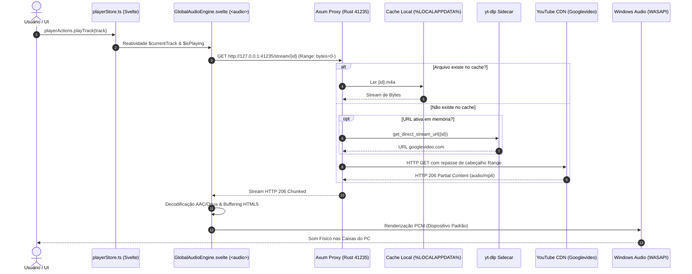

# Estado Atual do Pipeline de Áudio do Pulsar (Current State)

> Documento oficial de diagnóstico arquitetural da Fase 1 do projeto **Pulsar Connect**.  
> Baseado no código-fonte em `g:\GitHub\Vibecoding\VICCS_Git\VICCS_Pullsar`.

---

## 1. Visão Geral e Engine de Reprodução

### Onde vive o motor de áudio?
A reprodução física do áudio no Pulsar é **híbrida**, dividida entre o processo nativo em Rust (backend) e o contexto do WebView2 Chromium (frontend):

| Camada | Tecnologia | Localização no Código | Responsabilidade Primária |
| :--- | :--- | :--- | :--- |
| **Frontend** | HTML5 `<audio>` Element | [`src/lib/components/GlobalAudioEngine.svelte`](file:///g:/GitHub/Vibecoding/VICCS_Git/VICCS_Pullsar/src/lib/components/GlobalAudioEngine.svelte) | Decodificação de áudio, buffer de streaming, crossfade, controle de volume, disparo de scrobble Last.fm. |
| **Backend** | Axum HTTP Proxy (Porta `41235`) | [`src-tauri/src/audio_engine/mod.rs`](file:///g:/GitHub/Vibecoding/VICCS_Git/VICCS_Pullsar/src-tauri/src/audio_engine/mod.rs) | Proxy local HTTP com suporte a requisições parciais `Range` (HTTP 206), cache em disco (`.m4a`) e resolução sob demanda via `yt-dlp`. |
| **Sidecar** | Binário `yt-dlp` embutido | [`src-tauri/src/youtube/mod.rs`](file:///g:/GitHub/Vibecoding/VICCS_Git/VICCS_Pullsar/src-tauri/src/youtube/mod.rs) | Extração de URLs brutas de streaming `googlevideo.com` e busca acústica (`ytsearch1:`). |

Nenhuma biblioteca nativa de áudio de baixo nível (como `rodio`, `cpal`, `symphonia` ou `miniaudio`) está sendo utilizada no backend Rust atualmente. O áudio é consumido pelo navegador embutido do WebView2 diretamente via URL de loopback:
```text
http://127.0.0.1:41235/stream/{youtube_video_id}
```

---

## 2. Roteamento de Saída e Dispositivo de Áudio

### Como o som chega ao dispositivo de saída?
- O elemento `<audio>` do WebView2 direciona todo o sinal decodificado para o **Dispositivo Padrão do Windows (`Default Audio Render Device`)**.
- O roteamento é gerenciado pelo subsistema de áudio padrão do Chromium (usando **WASAPI Compartilhado** no Windows 10/11).
- **Não existe seleção de dispositivo de saída:** O aplicativo não expõe nenhum seletor de hardware (alto-falantes, fones de ouvido USB, Bluetooth ou placas de som dedicadas). Qualquer alteração de saída exige que o usuário abra o mixer de som do Windows nas configurações do sistema operacional.
- **Acoplamento:** O player assume tacitamente que existe apenas um único canal de saída por sessão: a saída primária da máquina local.

---

## 3. Matriz de Responsabilidades do Pipeline de Áudio



### Detalhamento das Etapas:
1. **Extração / Resolução:** O sidecar `yt-dlp` extrai streams de formato `-f "bestaudio[ext=m4a]/bestaudio/ba/b"`. Se for importação Spotify, faz a busca textual e acústica por duração antes de obter a URL.
2. **Streaming & Proxy:** O servidor Axum escuta em `127.0.0.1:41235`. Quando recebe requisições, repassa o cabeçalho `Range: bytes=X-Y`, viabilizando *seeking* (scrubbing) instantâneo sem precisar baixar o arquivo inteiro previamente.
3. **Decodificação & Buffer:** Delegada inteiramente ao pipeline de mídia do Chromium (decodificador embutido de AAC/MP4 e Opus/WebM). O buffer de antecipação segue a estratégia interna do elemento `<audio>`.
4. **Fila e Navegação:** Mantida em memória na store Svelte [`src/lib/stores/playerStore.ts`](file:///g:/GitHub/Vibecoding/VICCS_Git/VICCS_Pullsar/src/lib/stores/playerStore.ts) (`queue`, `queueIndex`, `history`, `shuffle`, `repeatMode`).
5. **Volume e Mute:**
   - **Controle interno por software:** Controlado estritamente pela propriedade `audioElement.volume` (número de 0.0 a 1.0). Não altera o volume master do Windows.
   - **Normalização de Volume:** Quando ativada (`audioNormalization: true`), multiplica o volume base por um fator de teto fixo (`0.92`) para mitigar picos de distorção entre faixas de diferentes canais.
6. **Crossfade:**
   - Implementado matematicamente em JavaScript dentro do evento `ontimeupdate` de [`GlobalAudioEngine.svelte`](file:///g:/GitHub/Vibecoding/VICCS_Git/VICCS_Pullsar/src/lib/components/GlobalAudioEngine.svelte).
   - Realiza interpolação linear (`remaining / crossfade`) nos últimos segundos da faixa em fade-out e chama `playerActions.next()` quando restam menos de 0.25s. Ao mesmo tempo, aplica fade-in suave nos primeiros 2s da faixa seguinte.

---

## 4. Pontos de Acoplamento e Limitações para o Pulsar Connect

Para que o Pulsar Connect (streaming para receivers UPnP, Google Cast e Bluetooth) funcione sem fricção, os seguintes acoplamentos do estado atual foram catalogados:

1. **Endereço de Loopback Local (`127.0.0.1`):**
   - O servidor Axum atualmente vincula-se a `127.0.0.1:41235`.
   - **Impacto no Connect:** Dispositivos remotos na rede local (ex.: caixa de som UPnP no IP `192.168.1.150`) **não conseguem acessar `127.0.0.1`**, pois o loopback apontará para o próprio dispositivo remoto.
   - **Adequação necessária:** O servidor precisa escutar em `0.0.0.0:41235` (todas as interfaces) ou resolver dinamicamente o IP da placa de rede local ativa do Windows para construir URIs públicas como `http://192.168.1.100:41235/stream/{id}`.
2. **Ciclo de Vida Acoplado ao DOM:**
   - Play/Pause, Seek e término de faixa dependem exclusivamente dos eventos do elemento `<audio>` (`ontimeupdate`, `onended`).
   - Se o áudio for enviado para um dispositivo UPnP ou Cast, esse elemento HTML local estará mudo ou inativo, e os eventos de progresso e fim de faixa precisarão vir de polling de estado remoto (ex.: UPnP `GetPositionInfo`).
3. **Suposição de Latência Zero de Rede:**
   - O player local opera com latência de decodificação na casa de dezenas de milissegundos (< 50ms).
   - Dispositivos de rede (UPnP/Cast) possuem buffers de streaming próprios que podem introduzir de 500ms a 2000ms de atraso entre o comando de play/pause e a reação audível.

---

## 5. Dependências e Versões Envolvidas

| Componente | Dependência | Versão Atual |
| :--- | :--- | :--- |
| **Rust Backend Runtime** | `tauri` | `2.x` |
| **Proxy HTTP Local** | `axum` | `0.8.9` |
| **Servidor Assíncrono** | `tokio` | `1.53.1` (com feature `full`) |
| **Cliente HTTP Upstream** | `reqwest` | `0.13.5` (com features `stream`, `json`) |
| **Utilitários de Stream** | `tokio-util`, `futures-util` | `0.7.19`, `0.3.34` |
| **APIs do Windows** | `windows` | `0.58` (`Win32_UI_Shell`, `Win32_System_Com`) |
| **Frontend Framework** | `svelte` | `5.56.3` (Runes Mode) |
| **Sidecar de Mídia** | `yt-dlp` | `2026.08.19` (binário x86_64 empacotado) |

---

## 6. Conclusão da Fase 1

O Pulsar possui uma infraestrutura de áudio robusta, rápida e desacoplada em termos de dados e streaming (graças ao proxy Axum HTTP 206). Contudo, toda a reprodução física está concentrada no elemento `<audio>` da interface Svelte, operando como o único sink do sistema.

Para evoluir para o **Pulsar Connect**, a **Fase 2** definirá a abstração `AudioOutputTarget`, permitindo que o `<audio>` atual torne-se apenas o `LocalOutputTarget`, abrindo espaço para os adapters de rede sem quebrar a estabilidade atual.
