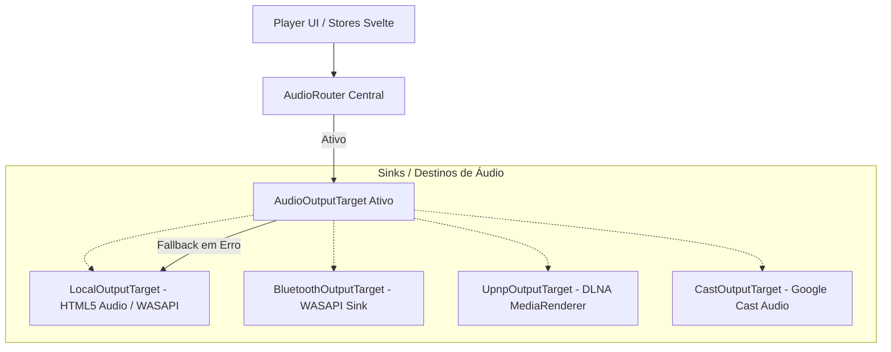
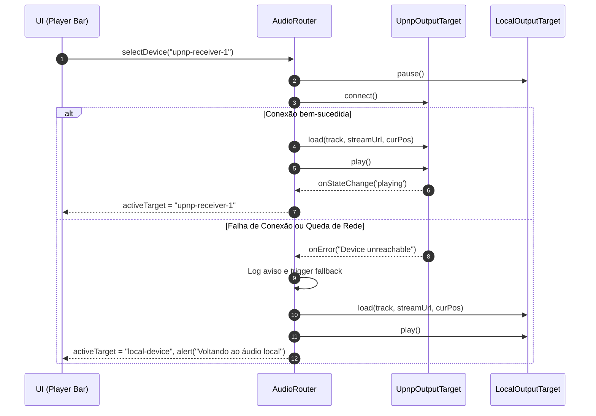

# Camada de Abstração de Saída de Áudio (Audio Output Abstraction)

> **Documento Oficial de Arquitetura — Fase 2 do Pulsar Connect**  
> **Status:** Aprovado para Implementação  
> **Depende de:** [`docs/audio/CURRENT_STATE.md`](file:///g:/GitHub/Vibecoding/VICCS_Git/VICCS_Pullsar/docs/audio/CURRENT_STATE.md)  
> **Alvo:** Desacoplar decodificação e transporte de áudio do dispositivo físico final.

---

## 1. Visão Geral e Motivação

Na Fase 1, identificamos que o Pulsar dependia diretamente do elemento `<audio>` do DOM dentro de `GlobalAudioEngine.svelte`, que direciona o som exclusivamente ao dispositivo padrão do Windows (WASAPI Compartilhado).

Para viabilizar o **Pulsar Connect** (transmissão para receivers UPnP/DLNA, caixas Google Cast Audio e fones/caixas Bluetooth), é necessário introduzir um padrão arquitetural de **Sink / Target** gerenciado por um **AudioRouter**:



### Princípios Inegociáveis:
1. **Zero Regressão Local:** O destino local padrão (`LocalOutputTarget`) deve manter 100% das capacidades atuais (crossfade, normalização de volume, scrobbler Last.fm, miniatura na taskbar do Windows).
2. **Transparência de Protocolo:** A interface do usuário (UI) não precisa saber os detalhes de SOAP, mDNS ou WASAPI. Ela consome apenas uma lista unificada de `AudioDevice` e despacha ações para o `AudioRouter`.
3. **Resiliência e Fallback Instantâneo:** Se um dispositivo de rede for desligado ou a conexão Wi-Fi oscilar, o router não pode congelar o player; ele deve chavear silenciosamente de volta para o `LocalOutputTarget` na mesma posição temporal (`currentTime`).

---

## 2. Contratos e Interfaces (TypeScript)

A camada de abstração é definida em `src/lib/audio/types.ts`.

### 2.1. Tipagem de Dispositivos e Estados

```typescript
export type AudioTargetType = 'local' | 'bluetooth' | 'upnp' | 'cast';

export type AudioTargetState = 
  | 'disconnected'
  | 'connecting'
  | 'idle'
  | 'buffering'
  | 'playing'
  | 'paused'
  | 'error';

export interface AudioDevice {
  id: string;
  name: string;
  type: AudioTargetType;
  isDefault?: boolean;
  details?: string;
  volumeSupported: boolean;
  approximateLatencyMs: number;
}
```

### 2.2. Contrato `AudioOutputTarget`

Todo destino de saída (seja a placa de som local ou uma caixa UPnP) implementa a mesma interface:

```typescript
export interface AudioOutputTarget {
  readonly id: string;
  readonly name: string;
  readonly type: AudioTargetType;
  readonly volumeSupported: boolean;
  readonly approximateLatencyMs: number;

  // Ciclo de Conexão
  connect(): Promise<void>;
  disconnect(): Promise<void>;

  // Transporte de Áudio
  load(track: Track, streamUrl: string, startPositionSeconds?: number): Promise<void>;
  play(): Promise<void>;
  pause(): Promise<void>;
  seek(positionSeconds: number): Promise<void>;
  setVolume(volume: number): Promise<void>; // 0.0 a 1.0
  setMuted(muted: boolean): Promise<void>;

  // Observabilidade e Estado
  getState(): AudioTargetState;
  onStateChange(callback: (state: AudioTargetState) => void): () => void;
  onTimeUpdate(callback: (currentTime: number, duration: number) => void): () => void;
  onEnded(callback: () => void): () => void;
  onError(callback: (error: string) => void): () => void;
}
```

---

## 3. O Roteador Central (`AudioRouter`)

O `AudioRouter` (`src/lib/audio/AudioRouter.ts`) é um Singleton orquestrador. Suas responsabilidades são:

1. **Gerenciar o Sink Ativo:** Aponta para o `AudioOutputTarget` atual (inicializado com `LocalOutputTarget`).
2. **Sincronização com Stores:** Propaga eventos de tempo (`currentTime`), buffer (`isBuffering`) e fim de faixa (`playerActions.next()`) para as stores Svelte existentes.
3. **Chaveamento Dinâmico (Handover):** Ao alternar de um dispositivo para outro durante a reprodução:
   - Captura a posição atual `curTime` e o estado `isPlaying`.
   - Pausa e desconecta o sink anterior.
   - Conecta e carrega a faixa no novo sink com `startPositionSeconds = curTime`.
   - Se estava tocando, dispara `play()` no novo sink.
4. **Mecanismo de Fallback Automático:**
   - Se o sink remoto disparar `onError` ou desconexão inesperada, o `AudioRouter` aciona o plano de contingência:
     ```text
     Erro no Sink Remoto -> Notificar UI -> Reativar LocalOutputTarget(curTime) -> Retomar Playback Local
     ```



---

## 4. Implementação do `LocalOutputTarget`

O `LocalOutputTarget` (`src/lib/audio/targets/LocalOutputTarget.ts`) é a primeira implementação concreta da abstração. Ele encapsula o elemento `<audio>` HTML5:

- **Volume & Normalização:** Aplica o fator `normFactor = 0.92` e o volume base.
- **Crossfade:** Executa o algoritmo de interpolação linear existente.
- **Despacho de Eventos:** Converte os eventos nativos do DOM (`ontimeupdate`, `onwaiting`, `onplaying`, `onended`, `onerror`) para os callbacks padronizados da interface `AudioOutputTarget`.

Isso garante que, na Fase 2, o Pulsar continue operando 100% funcional, porém agora com o motor de áudio totalmente desacoplado da casca do componente.

---

## 5. Exposição Agonóstica para a UI

Para o frontend (components como `BottomPlayerBar.svelte` e modais), o subsistema expõe uma store unificada:

```typescript
// Svelte store contendo todos os dispositivos conhecidos
export const availableAudioDevices = readable<AudioDevice[]>(...);

// Store com o dispositivo atualmente conectado
export const activeAudioDevice = readable<AudioDevice>(...);

// Estado de conexão do Connect
export const connectStatus = readable<'idle' | 'discovering' | 'connecting' | 'connected' | 'error'>(...);
```

---

## 6. Critérios de Aceitação da Fase 2

- [x] Contratos TypeScript criados e tipados estritamente em `src/lib/audio/types.ts`.
- [x] `LocalOutputTarget` implementado sem regressão visual ou sonora.
- [x] `AudioRouter` operando como orquestrador central com fallback para local.
- [x] `GlobalAudioEngine.svelte` atualizado para interagir através do `AudioRouter`.
- [x] Build limpo sem erros de tipagem (`npm run check`) e compilação Rust estável (`cargo check`).
